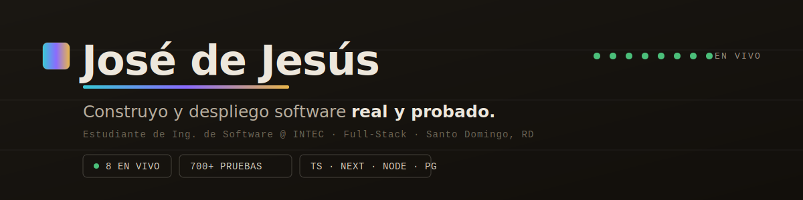

  

  
  
  

  <b>No hago ejercicios de clase: hago productos que se usan.</b> 
  <b>8 proyectos en vivo</b> en internet · <b>700+ pruebas automatizadas</b> · full-stack de la idea al <i>deploy</i>. 
  🔭 Buscando una <b>pasantía de desarrollo de software</b> — Santo Domingo 🇩🇴 / remoto LATAM

---

### 🌟 Míralo funcionando

<table width="100%">
<tr>
<td width="50%" valign="top">

#### 🎨 [Portafolio interactivo →](https://dejesusestevez.netlify.app)
Cada proyecto muda de piel según su dominio y trae **demos que funcionan de verdad**: valida un 606/607/608, calcula prestaciones, anota un fiado. Bilingüe ES/EN.
`JavaScript` · `Canvas` · `data-driven`

</td>
<td width="50%" valign="top">

#### 📄 [e-CF, explicado →](https://facturard.netlify.app)
Una pieza *scrollytelling*: un comprobante de papel **cobra vida y se vuelve electrónico** mientras scrolleas, y la página migra de papel a azul digital.
`HTML/CSS/JS` · `0 librerías` · `scroll-driven`

</td>
</tr>
</table>

---

### 🚀 Proyectos de ingeniería

**⚡ DELCA — Plataforma para distribuidora eléctrica** · [🔗 En vivo](https://delca.onrender.com)
Backend **Node.js/Fastify + PostgreSQL/PostGIS + Redis** (índices GiST). Facturación electrónica transaccional (NCF con control de concurrencia), telemetría de medidores y mapeo geoespacial de apagones. **~96 pruebas (Vitest)**, CI y ADRs. Con cliente móvil Kotlin/Android.

**🏦 Banca Simón — Sistema de gestión de préstamos**
**Next.js 15 + TypeScript + Drizzle ORM** para un prestamista real en RD. **512 pruebas**, montos en centavos (sin floats), **auditoría append-only con cadena de hashes**, RBAC y pagarés/recibos en PDF. De extremo a extremo con feedback real del usuario.

**🏥 UAO — Facturación para clínica oftalmológica** · [🔗 En vivo](https://uao-facturacion.vercel.app)
**Next.js 15 + PostgreSQL (Neon) + Better-Auth**. Emite NCF fiscales de la DGII, cuentas por cobrar, caja diaria y cierres mensuales con doble firma. **70 pruebas**, 16 módulos y RBAC de 4 roles.

🛠️ Y herramientas propias: <b>hilo</b> (CLI en Node que reconstruye "en qué ibas" con la API de Claude · 48 tests) · <b>Chess Live</b> (visión por computadora con OpenCV/PySide6 + Stockfish · 40 tests).

---

### 📦 Productos en vivo (República Dominicana)

<table width="100%">
<tr><th align="left">Producto</th><th align="left">Qué resuelve</th><th align="left">En vivo</th></tr>
<tr><td><b>Contáfacil</b></td><td>Valida tus formatos 606/607/608 antes de subirlos a la DGII</td><td><a href="https://validadordgii.netlify.app">Abrir&nbsp;▸</a></td></tr>
<tr><td><b>¿Cuánto Me Toca?</b></td><td>Calcula tu liquidación laboral (Ley 16-92)</td><td><a href="https://prestacionesrd.netlify.app">Abrir&nbsp;▸</a></td></tr>
<tr><td><b>FiaoYa</b></td><td>La libreta de fiados del colmado, que cuadra sola</td><td><a href="https://fiaoya.netlify.app">Abrir&nbsp;▸</a></td></tr>
<tr><td><b>Aprueba RD</b></td><td>Practica el examen teórico de licencia (Ley 63-17)</td><td><a href="https://apruebard.netlify.app">Abrir&nbsp;▸</a></td></tr>
<tr><td><b>CumpleFactura</b></td><td>Prepárate para la facturación electrónica e-CF (Ley 32-23)</td><td><a href="https://cumplefactura.netlify.app">Abrir&nbsp;▸</a></td></tr>
</table>

---

### 🧰 Tecnologías

  
  
  
  
  
  
  
  
  
  
  
  
  

---

🎓 Ingeniería de Software · Instituto Tecnológico de Santo Domingo (INTEC) · Certificación HCIA-AI V3.5 (Huawei)

